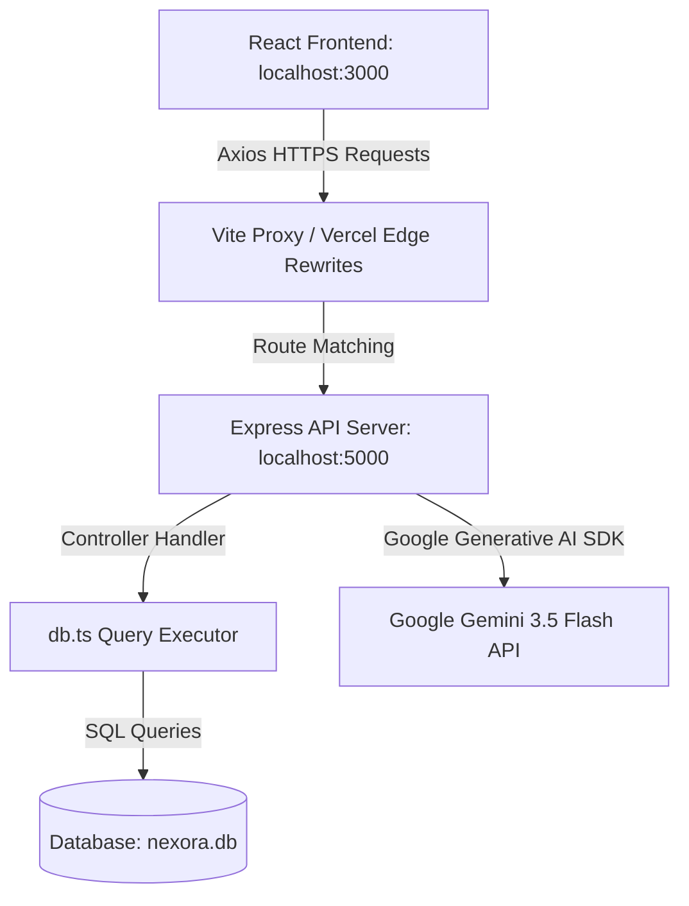

# Nexora Project Architecture & Codebase Guide

This document provides a comprehensive technical overview of the **Nexora Student Portal** codebase, explaining the design patterns, file roles, database interactions, and the context-aware AI integration. You can use this guide directly for slides or pitch references at the hackathon.

---

## 1. System Architecture Overview

Nexora is built on a modern **Full-Stack REST Architecture** utilizing a React client-side application, a Node/Express API server, and a dual-driver relational database.



*   **Loose Coupling:** The frontend and backend are completely decoupled. They communicate exclusively via JSON over HTTP.
*   **Production Rewrite Bridge:** In production, cross-origin resource sharing (CORS) is handled by server-level rewrites (configured in `frontend/vercel.json`), routing relative client requests (e.g. `/api/...`) to the Render backend service seamlessly.

---

## 2. File-by-File Breakdown & Operational Flows

### 🖥️ Frontend (Client Component Layer)

1.  **Application Entry ([main.tsx](file:///c:/Users/david/OneDrive/Desktop/Nexora-main/Nexora-main/frontend/src/main.tsx)):** Mounts the React application tree inside the HTML `#root` element and wraps it in a router context.
2.  **Route Guard & Layout ([App.tsx](file:///c:/Users/david/OneDrive/Desktop/Nexora-main/Nexora-main/frontend/src/App.tsx) & [Layout.tsx](file:///c:/Users/david/OneDrive/Desktop/Nexora-main/Nexora-main/frontend/src/components/Layout.tsx)):**
    *   Determines authorization status. If unauthenticated, it forces a redirect to the login screen.
    *   The `Layout` wrapper mounts the navigation sidebar alongside the **floating AI Chatbot drawer**, ensuring the assistant remains accessible from all subpages.
3.  **Authentication Context ([AuthContext.tsx](file:///c:/Users/david/OneDrive/Desktop/Nexora-main/Nexora-main/frontend/src/contexts/AuthContext.tsx)):**
    *   Maintains the active `user` state and `token` string.
    *   Upon a successful login request, it registers the JWT token into `localStorage` and configures Axios defaults (`axios.defaults.headers.common['Authorization']`), meaning every subsequent endpoint query automatically includes the token.
4.  **Dashboard Hub ([Dashboard.tsx](file:///c:/Users/david/OneDrive/Desktop/Nexora-main/Nexora-main/frontend/src/pages/Dashboard.tsx)):**
    *   *Dynamic Greeting:* Eases user friction by displaying time-based greetings ("Good morning/afternoon/evening").
    *   *Real-time Class Schedules:* Resolves system time and displays active classes for that specific weekday. If accessed on a Saturday or Sunday, it falls back to a preview of Monday's courses.
    *   *Maximizable Event Cards:* Features groups-hover overlays. Clicking a card opens a spring-transition modal (`scale-up`/`fade-in`) loading high-resolution poster images and reservation logic.
5.  **Department Hub ([ForYou.tsx](file:///c:/Users/david/OneDrive/Desktop/Nexora-main/Nexora-main/frontend/src/pages/ForYou.tsx)):**
    *   Renders student-specific analytics: GPA trackers, attendance progress, and task completion percentage bars.
    *   Retrieves contact cards for department faculty and HODs directly from the relational database.
6.  **Admin Portal ([AdminPanel.tsx](file:///c:/Users/david/OneDrive/Desktop/Nexora-main/Nexora-main/frontend/src/pages/AdminPanel.tsx)):**
    *   Integrates forms to broadcast notifications, post events, update bus routes, and schedule classes.
    *   *Live Timetable Grid Inspector:* Includes an interactive department-level and semester-level scheduler board. Admins can view Monday-Friday classes in a visual grid and click trash icons to delete slots, immediately sync'ing schedules for all student dashboards in that department.

---

### ⚙️ Backend (API Server Layer)

1.  **Server Initializer ([server.ts](file:///c:/Users/david/OneDrive/Desktop/Nexora-main/Nexora-main/backend/src/server.ts)):**
    *   Mounts JSON body-parsers and CORS policies.
    *   Mounts the `/uploads` folder as a static express directory so event posters are served over the web.
    *   Connects to the database and binds the server listener.
2.  **API Router ([api.ts](file:///c:/Users/david/OneDrive/Desktop/Nexora-main/Nexora-main/backend/src/routes/api.ts)):**
    *   Configures route mappings, dividing them into **Public Routes** (Login/Register), **Student Protected Routes** (requiring authentication), and **Admin Protected Routes** (requiring both authentication and role verification).
3.  **Database Bridge ([db.ts](file:///c:/Users/david/OneDrive/Desktop/Nexora-main/Nexora-main/backend/src/config/db.ts)):**
    *   *Database Portability:* Exposes wrapper functions `query<T>()` and `exec()` which resolve parameter markers (`?`). This allows switching between local **SQLite** database files and production **MySQL** engines by editing the `DB_TYPE` variable in `.env`.
    *   *Automatic Migrations:* Checks tables, updates columns (e.g. `image_url` on the events table), and seeds data automatically.

---

## 3. High-Impact Hackathon Feature: Context-Aware AI Chatbot

The **Nexora AI Assistant** is implemented using a **Retrieval-Augmented Generation (RAG)** pipeline. Here is the lifecycle of a student's prompt:

```text
[Student Prompt] 
       │
       ▼
[JWT Token Authentication] ──► Extracts Student ID (e.g., Alice Vance)
       │
       ▼
[Database Retrieval] ────────► Fetches Alice's:
       │                       - Timetable schedule for the week
       │                       - Attendance percentages
       │                       - Uncompleted assignments & grades
       │                       - Registered campus events & bus routes
       │
       ▼
[System Prompts Merger] ─────► Combines database context, date context (e.g. today is Thursday, July 16, 2026),
       │                       and system instructions: "Only answer using this database context."
       │
       ▼
[Gemini API Dispatch] ───────► Sends prompt payload to Gemini 3.5 Flash
       │
       ▼
[Response Generation] ───────► Saves conversation in history; renders Markdown response to Student Chat UI
```

This RAG pattern ensures that Gemini acts as a secure, context-aware college guide with **zero hallucination risk**, as it is restricted to answering questions using only the retrieved database records.
